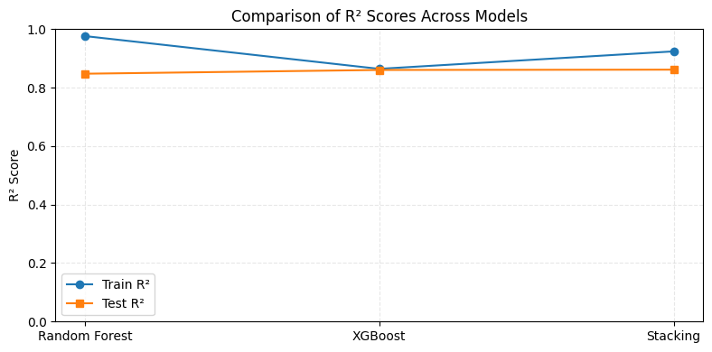
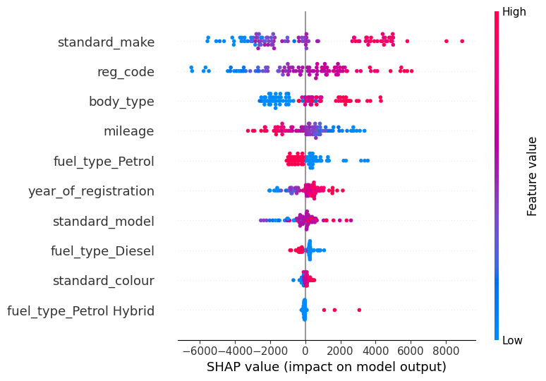

# Vehicle Price Prediction: From Classical ML to Explainable Ensembles

[](https://www.python.org/)
[](https://scikit-learn.org/)
[](https://github.com/Mohmdamirian/autotrader-price-prediction/actions/workflows/tests.yml)

An end-to-end regression project that predicts advertised vehicle prices from
approximately 402,000 anonymised AutoTrader listings. The repository combines
two connected MSc assignments and shows the progression from classical machine
learning baselines to ensemble learning, explainable AI and representation
analysis.

## Project evolution

| Stage | Academic context | Main techniques | Recorded best result |
|---|---|---|---|
| 1. Foundations | Machine Learning Concepts (MLC) | EDA, missing-value handling, encoding, KNN, linear regression, decision trees, grid search and permutation importance | Decision Tree: test R² 0.847 |
| 2. Advanced extension | Advanced Machine Learning (AML) | RFECV/SFS, Random Forest, XGBoost, stacking, SHAP, PDP/ICE, PCA, Isomap and clustering | Stacking: test R² 0.862; test MAE 1,839 |

The advanced work is the more complete stage of the project. The MLC notebook
is retained because it makes the development path and improvement in modelling
practice visible.

> The figures and metrics in this README are recorded results from the original
> 2025 submissions. They have not been independently rerun in this cleaned
> repository because the dataset is not redistributed. Run the notebooks after
> obtaining the data to reproduce results in your own environment.

## Highlights

- Built a leakage-aware preprocessing workflow for mixed numerical and
  high-cardinality categorical vehicle data.
- Compared interpretable baselines with non-linear tree and distance-based
  regressors.
- Extended the baseline study with Random Forest, XGBoost and a stacked
  ensemble.
- Used permutation importance, SHAP, partial dependence and ICE plots to
  explain global and instance-level behaviour.
- Investigated linear and non-linear representations using PCA and Isomap.
- Added tests and an automated GitHub Actions workflow for the reusable data
  and preprocessing code.

## Results

### Stage 1: classical models

| Model | Train R² | Test R² | Test MSE |
|---|---:|---:|---:|
| Linear Regression | 0.717 | 0.719 | 15,445,038 |
| K-Nearest Neighbours | 0.879 | 0.839 | 8,842,503 |
| Decision Tree | 0.867 | **0.847** | **8,384,220** |

### Stage 2: ensemble models

| Model | Train R² | Test R² | Test MAE |
|---|---:|---:|---:|
| Random Forest | 0.976 | 0.848 | 1,881 |
| XGBoost | 0.864 | 0.861 | 1,860 |
| Stacking | 0.924 | **0.862** | **1,839** |

Random Forest achieved the strongest training fit but had the largest
generalisation gap. XGBoost and stacking produced more balanced test
performance, with stacking recording the lowest test MAE.



The full interpretation is available in [docs/results.md](docs/results.md).

## Explainability

The advanced analysis consistently identified vehicle make, registration code,
body type, mileage and year of registration as influential predictors.
SHAP was used to examine both the direction and magnitude of feature effects,
while PDP and ICE plots explored average and instance-specific responses.



## Repository structure

```text
.
├── data/
│   └── README.md
├── docs/
│   ├── images/
│   ├── reports/
│   ├── project-evolution.md
│   └── results.md
├── notebooks/
│   ├── 01_mlc_foundations.ipynb
│   └── 02_aml_advanced.ipynb
├── src/autotrader_price/
│   ├── data.py
│   ├── evaluation.py
│   └── preprocessing.py
├── tests/
├── pyproject.toml
└── requirements.txt
```

## Data

The dataset is not committed to this repository. Obtain the AutoTrader car
sale adverts dataset from its
[Kaggle dataset page](https://www.kaggle.com/datasets/shayanshahid997/autotrader-at-car-sale-adverts-dataset),
review its current terms, and place the downloaded file at:

```text
data/raw/adverts.csv
```

The expected schema and exclusion rationale are documented in
[data/README.md](data/README.md).

## Installation

```bash
git clone https://github.com/Mohmdamirian/autotrader-price-prediction.git
cd autotrader-price-prediction
python -m venv .venv
```

Activate the environment:

```bash
# Windows
.venv\Scripts\activate

# macOS or Linux
source .venv/bin/activate
```

Install the project and notebook dependencies:

```bash
python -m pip install --upgrade pip
python -m pip install -e ".[notebooks,dev]"
```

Launch Jupyter:

```bash
jupyter lab
```

Run `01_mlc_foundations.ipynb` before `02_aml_advanced.ipynb` to follow the
academic progression. The notebooks are independently executable.

## Portfolio improvements

The GitHub edition preserves the original research questions while correcting
issues that are common in coursework notebooks:

- learned preprocessing is fitted after the train/test split;
- the MLC fine-grained error analysis uses real predictions rather than
  simulated values;
- numerical features are scaled before PCA and Isomap;
- clustering uses target-independent features and is described as exploratory;
- local file paths, student identifiers and stale notebook warnings are
  removed;
- reusable functions, tests and environment metadata are provided.

These changes mean regenerated metrics may differ from the recorded submission
results.

## Limitations

- Advertised prices are not necessarily final transaction prices.
- The data represents a historical market snapshot and may not generalise to
  current listings.
- Geographic, trim-level, engine and seller information may improve accuracy
  but is not available in the supplied feature set.
- High-cardinality categorical variables require careful encoding.
- SHAP, Isomap and model selection can be computationally expensive on the full
  dataset.
- This is an analytical portfolio project, not a production valuation service.

## Academic origin

Developed by [Mohammad Amirian](https://github.com/Mohmdamirian) at Manchester
Metropolitan University:

- Machine Learning Concepts, 2024-2025
- Advanced Machine Learning, 2024-2025

Portfolio copies of the two reports are included under
[`docs/reports`](docs/reports). The code was reorganised after assessment for
clarity, privacy and reproducibility.

## Licence

Source code is released under the [MIT License](LICENSE). The academic reports
remain the copyright of Mohammad Amirian and are not covered by the software
licence. The dataset is not included and remains subject to its own terms.
