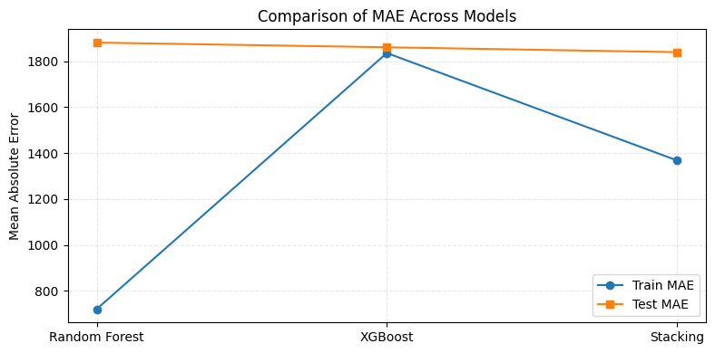
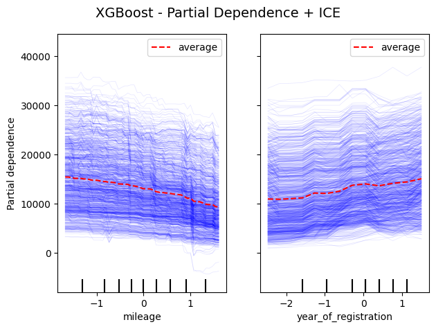

# Recorded results and interpretation

These results were produced in the original 2025 academic notebooks using an
80/20 split. They are reported here as historical project evidence and have not
been independently rerun in this repository because the dataset is excluded.

## MLC baselines

| Model | Selected configuration | Train R² | Test R² | Test MSE |
|---|---|---:|---:|---:|
| KNN | 35 neighbours; distance weights | 0.879 | 0.839 | 8,842,503 |
| Linear Regression | No fitted intercept | 0.717 | 0.719 | 15,445,038 |
| Decision Tree | Depth 20; leaf 5; split 20 | 0.867 | 0.847 | 8,384,220 |

The decision tree recorded the strongest baseline test score. KNN was close,
but is more expensive at prediction time for a dataset of this size. Linear
regression underfit the non-linear relationships.

The MSE values are squared price units and should not be described as direct
average price errors. The portfolio notebooks also calculate MAE and RMSE,
which are easier to interpret in the original target units.

## AML feature selection

Both RFECV and forward sequential feature selection recorded:

- test R²: 0.733;
- test MAE: 2,834; and
- a compact feature set dominated by registration code, make, model, body type,
  fuel type, mileage and registration year.

## AML ensembles

| Model | Train R² | Test R² | Train MAE | Test MAE |
|---|---:|---:|---:|---:|
| Random Forest | 0.976 | 0.848 | 720 | 1,881 |
| XGBoost | 0.864 | 0.861 | 1,835 | 1,860 |
| Stacking | 0.924 | 0.862 | 1,368 | 1,839 |

Random Forest's large training-test gap indicates overfitting. XGBoost
generalised more consistently. Stacking marginally improved the recorded test
metrics, although the small difference from XGBoost should not be overstated
without repeated cross-validation or uncertainty estimates.

## Explainability

Permutation importance and SHAP highlighted:

- vehicle make;
- registration code;
- body type;
- mileage;
- year of registration; and
- selected fuel-type and model categories.

The PDP/ICE analysis showed the expected broad pattern: predicted prices
decreased with mileage and increased for newer registration years. These plots
describe model behaviour and association, not causal effects.

## Representation analysis

The original PCA result exceeded 95% cumulative variance after approximately
four components, but the source analysis did not standardise all encoded
features consistently. The portfolio notebook corrects this before PCA, so its
regenerated curve may differ.

K-Means exposed visible structure in a two-dimensional projection. This is
exploratory evidence only: the original notebook did not demonstrate that
adding cluster labels improved price prediction.
